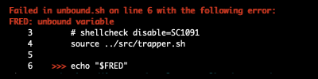

<!-- markdownlint-disable -->
<p align="center">
    <a href="https://github.com/DevelopersToolbox/">
        
    </a>
    <br />
    <a href="https://github.com/DevelopersToolbox/trapper/actions/workflows/cicd.yml">
        
    </a>
    <a href="https://github.com/DevelopersToolbox/trapper/blob/master/LICENSE.md">
        
    </a>
    <a href="https://github.com/DevelopersToolbox/trapper">
        
    </a>
    <br />
    <a href="https://github.com/DevelopersToolbox/trapper/releases/latest">
        
    </a>
    <a href="https://github.com/DevelopersToolbox/trapper/releases/latest">
        
    </a>
    <a href="https://github.com/DevelopersToolbox/trapper/releases/latest">
        
    </a>
    <br />
    <a href="https://github.com/DevelopersToolbox/trapper/blob/master/.github/CODE_OF_CONDUCT.md">
        
    </a>
    <a href="https://github.com/DevelopersToolbox/trapper/blob/master/.github/CONTRIBUTING.md">
        
    </a>
    <a href="https://github.com/DevelopersToolbox/trapper/blob/master/.github/SECURITY.md">
        
    </a>
    <a href="https://github.com/DevelopersToolbox/trapper/issues">
        
    </a>
</p>

## Overview

At Wolf Software we write a lot of bash scripts for many purposes and the one thing that we found lacking was a simple to use debugging tool. 

Trapper is something that weas developed originally for internal use to debug scripts we release with the aim being a simple plugin that required minimal changes to the original script.

Trapper is capable of capturing a large array of runtime errors and attempts to point to where the error happened.

## Usage

Simply source trapper at the top of your script and then execute it as normal. 

Trapper works by setting a trap for any errors and attempts to display where the errors happened.

> Truncated snippet
```
set -Eeuo pipefail

function trap_with_arg()
{
    func="$1";
    shift

    for sig ; do
        # shellcheck disable=SC2064
        trap "$func $sig" "$sig"
    done
}

trap_with_arg 'failure ${?}' ERR EXIT
```

It is capable of detecting errors in a many different scenarios.

| Scenario          | Requirements                               | Results                                                                                |
| ----------------- | ------------------------------------------ | -------------------------------------------------------------------------------------- |
| Single script     | Include trapper.sh                         | Reports filename, line number and code snippet.                                        |
| Executing scripts | Include trapper.sh (in all scripts)        | Reports filename, line number and code snippet for full stack trace (calling scripts). |
| Including scripts | Include trapper.sh (only in parent script) | Reports filename, line number and code snippet of the failing included script.         |

## Examples

### Testing for unset (unbound) variables

Single script attempt to use an unbound variable.

[Source](tests/unbounded/unbounded.sh)



### Testing execute stack (scripts calling scripts)

Parent script executing child script with error in the final child.

[Source](tests/execute-stack/parent.sh)


### Testing source stack (scripts including scripts)

Parent script including (sourcing) child scripts with an error in the final child.

[Source](tests/source-stack/parent.sh)


<br />
<p align="right"><a href="https://wolfsoftware.com/"></a></p>
